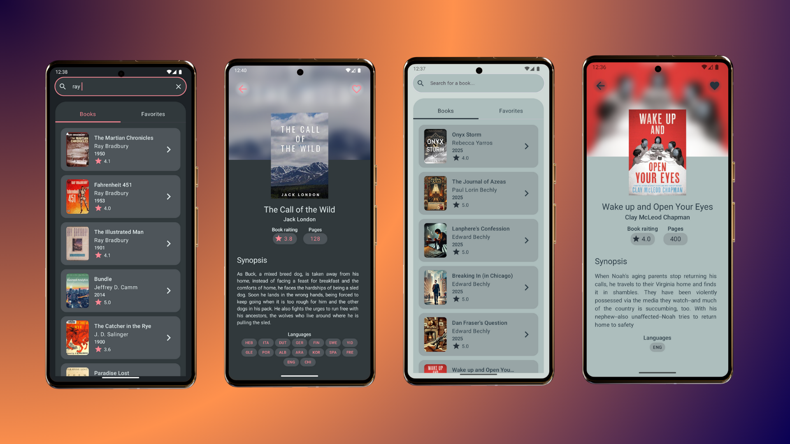

# Open Library Mobile App

### Мультиплатформенное приложение работающее с API сервиса Open Library.

## Описание приложения:
Простое демо-приложение, которое позволяет осуществлять поиск, просмотр детальной информации, сохранение в избранное книг, которыми располагает сервис Open Library.
Приложение одномодульное, использующее общую бизнес-логику (Kotlin Multiplatform) и общий интерфейс (Compose Multiplatform) для платформ: Android, iOS, Desktop.

#### Главный экран
- содержит список ТОП-50 популярных книг в текущем году. Так же на главном экране отображается поисковая строка, где можно ввести поисковый запрос. После срабатывания поискового запроса отображается список найденных книг.
- список книг «Избранное»: содержит ваши избранные книги.
- переход между основным списком и списком избранных книг осуществляется либо нажатием на определенный таб, либо свайпом в сторону.

#### Экран детальной информации
- по нажатию на элемент списка, откроется экран с детальной информацией о книге, на котором представлена обложка книги, название книги, имя автора,  средний рейтинг, количество страниц, синопсис, языки на которых издана книга.
- в верхей части имеется кнопка добавления в избранное, по нажатию которой, выбранная книга будет отображатся в списке избранных книг, а информация о книге будет доступна локально.
- так же, в верхней части экрана имеетя кнопка перехода обратно, к главному экрану.

## Конфигурация:
- Для сборки проекта используется Gradle Plugin 8.5.2
- Android compile SDK 35
- Android min SDK 24
- Версия Kotlin 2.1.10
- Для управлением состояним интерфейса используется шаблон MVI.
- Для навигации между эранами используется Navigation with Compose.
- Для внедрения заависимостей используется Koin.  

  
## Используемые библиотеки:
* **Koin 4** - для внедрения зависимостей.
* **KotlinX Serialization** - для сериализации данных.
* **Room** - для работы в базой данных.
* **Ktor** - для работы с сетевыми запросами.
* **Coil 3** - для загрузки и работы с  изображениями.

## Структура проекта:
### `/composeApp`
Папка для кода, который будет использоваться во всех приложениях Compose Multiplatform. Включает несколько подпапок:
- **`commonMain`**: код, общий для всех платформ.
- Остальные папки содержат Kotlin-код, который компилируется только для указанной в названии папки платформы.  
  Например, если вы хотите использовать **CoreCrypto** от Apple для iOS, код нужно поместить в папку **`iosMain`**.

### `/iosApp`
- содержит iOS-часть приложения.
Даже если интерфейс создан с использованием Compose Multiplatform, вам понадобится эта папка как точка входа для iOS-приложения.  
Кроме того, здесь можно добавлять код на **SwiftUI**.

## Запуск проекта:
#### Android
 - запуск обычными методами Android Studio.

#### Desktop
 - в терминале выполнить команду `.\gradlew run`.

#### iOS
 - в корне проекта найти папку `/iosApp/iOSApp.xcodeproj/project.xcworkspace` и открыть ее в Xcode.
 - выполнить первоначальную компиляцию проекта для устранения проблем с внешними зависимостями.
 - запустить проект в Xcode.

## Полезные ссылки:
- Узнайте больше о [Kotlin Multiplatform](https://www.jetbrains.com/help/kotlin-multiplatform-dev/get-started.html).
- Template нового проекта можно создать тут: [Kotlin Multiplatform Wizard](https://kmp.jetbrains.com/).
- Все доступные библиотеки для KMP: [Kotlin Multiplatform Libs](https://klibs.io/).
- Open Library Web APIs: [link](https://openlibrary.org/developers/api).
